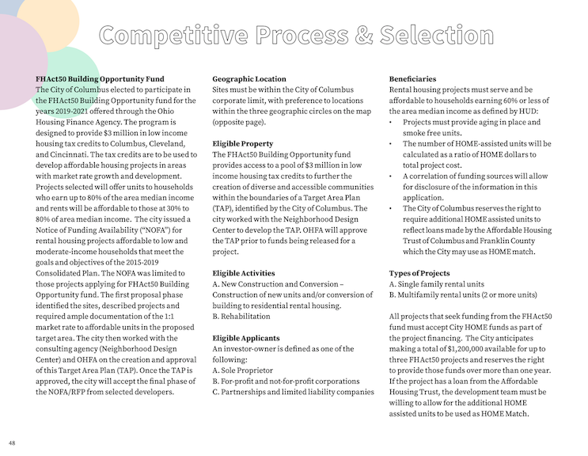
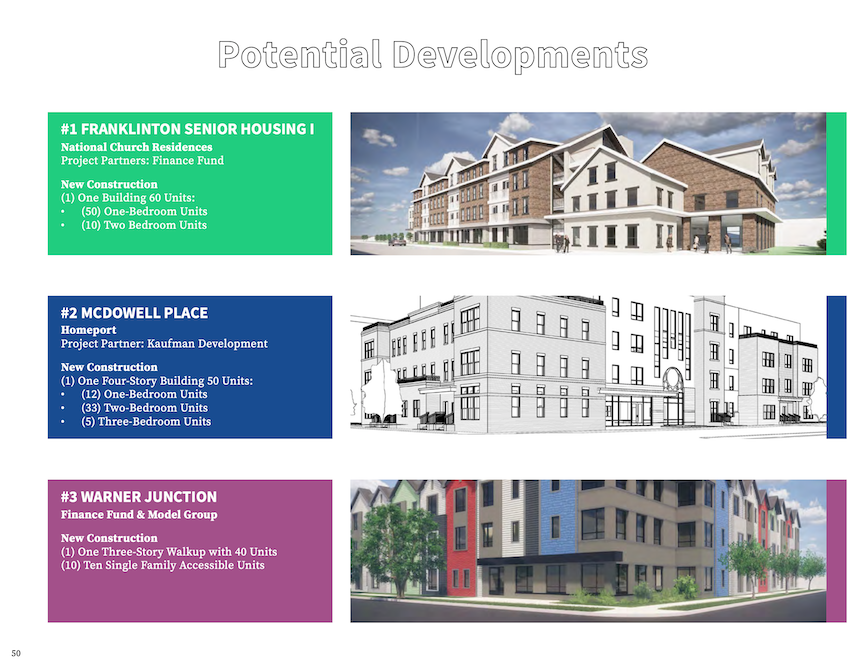

```{r setup, include=FALSE}
knitr::opts_chunk$set(echo = FALSE)
require(visNetwork)
require(readxl)
require(igraph)
nodes <- as.data.frame(read_excel(path = "data.xlsx",sheet = "Nodes"))
edges <- as.data.frame(read_excel(path = "data.xlsx",sheet = "Edges"))
graph <- graph_from_data_frame(d = edges,directed = FALSE,vertices = nodes)
```

## What is a Network? {.build}

```{r}
plot(graph,vertex.label=NA,vertex.color="black",edge.color="black")
```

## Components of a Network

> - Node (Vertex or Point or Junction)
> - Edge (Connection or Flow or Relationship) 
> - Plot Area (Space or Graph)

## A Complex Example
[<text size="1"> Martin Grandjean (2016) A social network analysis of Twitter: Mapping the digital humanities community. </text>](https://www.tandfonline.com/doi/pdf/10.1080/23311983.2016.1171458?needAccess=true) 
  
  
## Other Examples
[visualcomplexity.com](http://www.visualcomplexity.com/vc/index.cfm?domain=Social%20Networks)   


## Strength and Weaknesses of Working with Networks

> - Networks are versatile but subjective
> - Questions of scale, limits, definitions
> - Nodes and Edges are ambiguous and arbitrary
> - Networks are impressive!

## What is a Node?

> - Any "Actor"
> - Individual
> - Organization
> - Place or Structure
> - Idea or Concept
> - OR a network!

## What is an Edge? {.build}

### Any type of relationship
  
Source: Borgatti, Stephen P., et al. "Network analysis in the social sciences." science 323.5916 (2009): 892-895.</text>
  
## CCF and Social Network

> - "The Community Capitals Framework (CCF) offers a way to analyze community and economic development efforts from a systems perspective by identifying the assets in each capital (stock), the types of capital invested (flow), the interaction among the capitals, and the resulting impacts across capitals." *Emery and Flora (2006)*
> - Networks of Stocks and Flows

## Mapping Community Based Organizations {.build}

> - Franklinton Target Area Plan pg. 48-61



## Mapping Community Based Organization {.build}

> - Affordable Housing Developments




