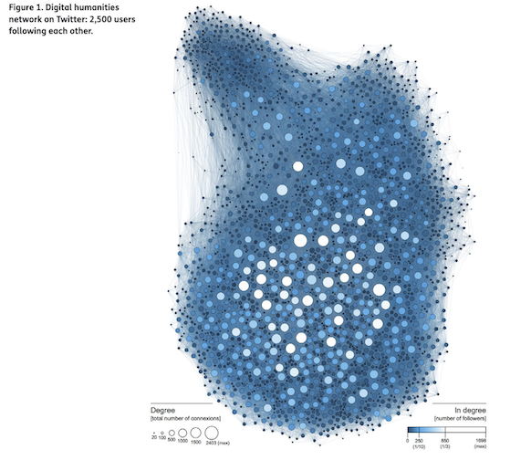
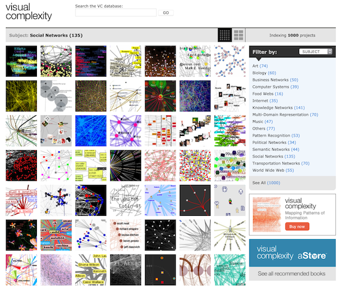
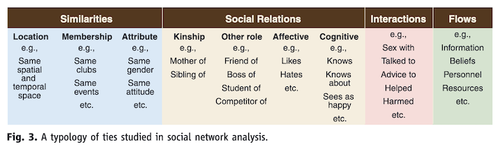

```{r setup, include=FALSE}
knitr::opts_chunk$set(echo = FALSE)
require(visNetwork)
require(readxl)
require(igraph)
require(xaringan)
require(gt)
nodes <- as.data.frame(read_excel(path = "data.xlsx",sheet = "Nodes"))
edges <- as.data.frame(read_excel(path = "data.xlsx",sheet = "Edges"))
graph <- graph_from_data_frame(d = edges[1:2],directed = FALSE)
vn <- toVisNetworkData(graph,idToLabel = FALSE)
table <- data.frame(
  CCF = c("Natural","Built","Human","Financial","Social","Political","Cultural"),
  Type = c(""),
  Example = c("")
)
```

```{r xaringan-themer, include=FALSE, warning=FALSE}
library(xaringanthemer)
style_mono_light(
  base_color = "#330000",
  link_color = "0000ff",
  header_font_google = google_font("IBM Plex Mono", "600"),
  text_font_google   = google_font("Open Sans", "400", "400i"),
  code_font_google   = google_font("IBM Plex Mono")
)
```
---

## What is a Network?

--

```{r}

visNetwork(nodes = vn$nodes,edges = vn$edges,width = "100%") %>%
  visPhysics(stabilization = FALSE) %>%
  visNodes(physics = TRUE) %>%
  visEdges(physics = TRUE)
  

```

---

## Components of a Network

--

- Node (Vertex or Point or Junction)

--

- Edge (Connection or Flow or Relationship) 

--

- Plot Area (Space or Graph)

---

## A Complex Example
Martin Grandjean (2016) A social network analysis of Twitter: Mapping the digital humanities community.
  

---

## Other Examples

[visualcomplexity.com](http://www.visualcomplexity.com/vc/index.cfm?domain=Social%20Networks)   


---

## Strength and Weaknesses of Working with Networks

--

- Networks are versatile but subjective

--

- Questions of scale, limits, definitions

--

- Nodes and Edges are ambiguous and arbitrary

--

- Networks are impressive!

---

## What is a Node?

--

- Any "Actor"

--

- Individual

--

- Organization

--

- Place or Structure

--

- Idea or Concept

--

- OR a network!

---

## What is an Edge?

--

### Any type of relationship
  
Source: Borgatti, Stephen P., et al. "Network analysis in the social sciences." science 323.5916 (2009): 892-895.</text>

---

## CCF and Social Network

--

- "The Community Capitals Framework (CCF) offers a way to analyze community and economic development efforts from a systems perspective by identifying the assets in each capital (stock), the types of capital invested (flow), the interaction among the capitals, and the resulting impacts across capitals." *Emery and Flora (2006)*

--

- Networks of Stocks and Flows

---

## Mapping Community Capitals

--
Break-out Groups

--

```{r table, echo=FALSE, warning=FALSE}
gt(table)
```
---

background-image:  url(data/TAPFHAct50.png)

---

background-image: url(data/TAPBuildings.png)

- pg. 48-61


