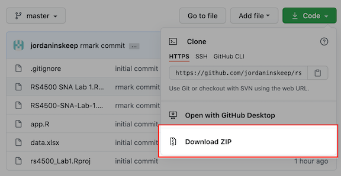
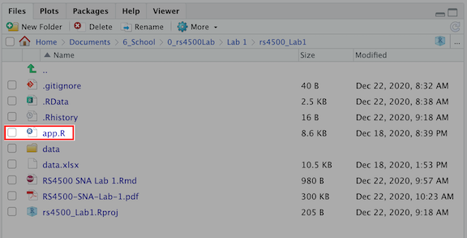
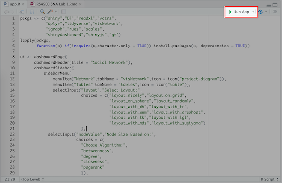
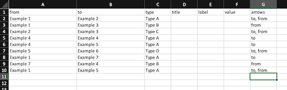
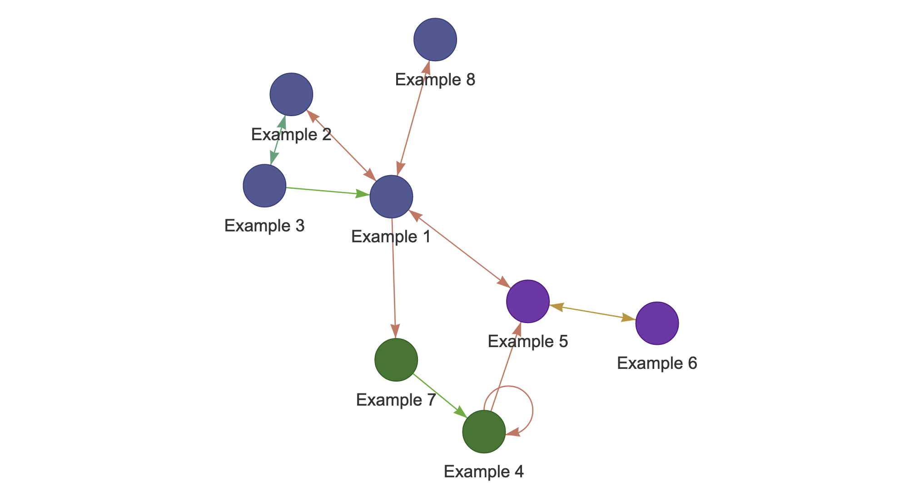

```{r setup, include=FALSE}
knitr::opts_chunk$set(echo = TRUE)
```

# Pre-Lab

## 1. Install R and RStudio

* **Click the link and follow the instructions to install R and RStudio.**
  + link: [rstudio-education.github.io/hopr/starting.html](https://rstudio-education.github.io/hopr/starting.html)
  + Open a new session and get familiar with interface.
  
## 2. Download and Open App for Lab 1
* **Download a .zip archive file for the Lab 1 files from my Github.**
  + Go to the link at [github.com/jordaninskeep/rs4500_Lab1](https://github.com/jordaninskeep/rs4500_Lab1)
  + Click the "Code" dropdown then select "Download Zip."  
    
      
  
*Github is a "version control" program that is used to track changes to and distribute code. Here you can find tons of packages and programs that other people have developed. We will us this to distribute code for your labs.*  

  * **Save this in a folder on your computer where you want to save your RS4500 Labs.**  
  * **Navigate to this folder and unzip this archive and open "rs4500_Lab1.Rproj"**  
  * **In the bottom right "Files" panel in RStudio open app.R, app.R should open in the top left panel of Rstudio.**  
    
    
    
*This shows your working directory, it shows all of the files in the folder related to the project. It is just like a file browser for your computer, with come extra R related options.*  
  
  * **Look through the code in the "app.R" window.**  
  
  *This is a script, it holds the code which makes up the program named "app.R". You can right code in this window, save it and run it. Don't worry to much about the code for now. And it isn't as complicated as it looks, by the end of the semester most of it will make sense.*  

  * **Run the App by clicking "Run App" in the top right of the "app.R" window.**  
    
    
  
*The program will install and load all of the packages needed to run the app. You will see this happen in red font in the console and then say "listening to" and IP address.*  

## 3. Get Familiar and Add a Node and Edge to the Example Network.

* **Get familiar with App**  

  + Adjust the Layout, Node Size and Grouping and Rearrange the Network by dragging the nodes. You can also play around with turning on/off the physics engine.  
  
  + Go to the Tables Tab by clicking the button on the left. Look through the tables and familiarize yourself with the tables.  Go back to the Network Tab. 
  
  
* **Add a node and an edge to the excel file.**  
 
  + Either from the Files Panel or in your local file browser, open data.xlsx  
    
    
  
*This is the same data that you saw in the table tab in the App. This App is actually reactive, meaning it is constantly look for updates in the excel file and then updating the app.*   

* **Add an Edge**
  +   In the "Edges" worksheet in the "from" column add Example 8 and in the "to" column connect it to Example 1. Add what Type you want it to be, and arrows on both ends of the edge by adding "to, from" in the arrows column.  
  
* **Add a Node**
  + Go the "Nodes" worksheet, Add Example 8 to the "name" column, Add a Type and a Label.  
  
  + Save the changes to the Excel file. Return and make sure this automatically updated the app. 
  
* **Add More Edges and Nodes**  
  + The most important thing is to make sure things are spelled right and is case-sensitive. And that all of the nodes called by the Edges table are in the Nodes table, and vice-versa.  
    

  
* **You are now done with the pre-lab.**   

# Lab 1 - Building Networks

## 1. Opening Social Network App (app.R) and the Network Data (data.xlsx)
  
  +   Open rs4500_Lab1.Rproj in RStudio then open and run app.R  
  
  +   Open data.xlsx in Excel
  
  +   In Excel select and delete all "Example" nodes and edges including their types, labels, etc.
  
  +   Save data.xlsx and check to make sure network app is cleared.
  
## 2. Begin Mapping Identifying Community Relationships

  *   Begin to enter relationships in the "Edges" worksheet of the data.xlsx file. **Pay close attention to spelling and capitalization.**  
      +   *to* and *from* are the names of connected *nodes*.  
      +   *type* is the type and color of the edge.  
          - *In this class it will be associated with the CCF.*  
      +   *title* is the description of the edge which is revealed in a pop-up.  
          - *You can chose this from the "CCF edges catalog", or come up with your own.*  
      +   *label* is a name for the edge. I normally do not use this.  
      +   *value* determines the width of the edge.  
      +   *arrows* determines whether there are arrowheads on the edges. Enter "to",  "from", or "to, from".  
  *   Enter the nodes used on the "Edges" worksheet into the "Nodes" worksheet.   
      +    For each relationship listed in the *to* and *from* column of the "Edges" worksheet, list it under the *name* column in "Nodes." **Again be cautious of spelling and capitalization.**  
  *   Fill out the other attributes for each node.  
      +   *name* is the name of the node.  
      +   *type* is the type of organization or association the node is. This is currenty not used in the app.  
      +   *title* is a description which is revealed in a pop-up.   
      +   Two other attributes will be created in the app, *value* and *group*. *We will discus both of these more in the next lab*  
          -   *value* will determine the size of the node. This is to represent measures of "centrality".  
          -   *group* will determine which group the node belongs to. This is determined by different algorithms in the app.  
  *   Save your excel data.xlsx and re-run your app.R code in RStudio if you need to. I suggest in the drop down under "Run App" choosing "Run External" so that it runs in your web browser.  
  
# A note on learning R  

For people who are more interested in learning R, I would suggest [R for Data Science](https://r4ds.had.co.nz/index.html). It is a great introduction to coding in R and data visualization. Also [Rstudio.com](https://rstudio.com/) has great webinars and tutorials in their resources section. 

I will also be posting a list of other resources specific to R and Network analysis in Carmen. When in doubt Google, adding r to what you are looking for should bring results. Also you can search or post to [stackoverflow.com](https://stackoverflow.com/questions/tagged/r), include "[r]" in your search. 

Lastly, programming languages are languages. This means learning them is like learning a language, all the same rules apply. Your best bet is to just give it a try and not be too hard on yourself when you hit a roadblock, take a break and come back to it later. "Speaking" or "writing" is the best way to learn. Look at other peoples code and try to replicate it. I taught myself all that I know in the past year, I am sure you could do the same or more. 

Feel free to reach out to me at inskeep.24@buckeyemail.osu.edu at any time. 
 

